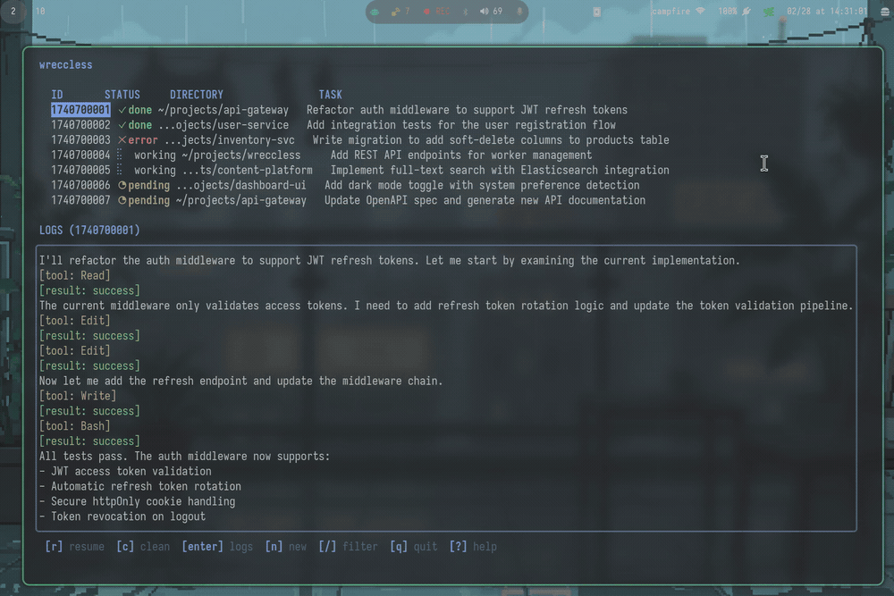

# wre(**CCL**)ess

Fire-and-forget [Claude Code](https://docs.anthropic.com/en/docs/claude-code) workers. Launch background sessions, track them, get out of the way.

<p>
  
  
</p>

Single binary. No daemon, no database. State lives as flat JSON files in `~/.local/state/ccl/`. Scripts, pickers, and status bars can talk to it.

## Install

```sh
go install github.com/scottstav/wreccless/cmd/ccl@latest
```

## Usage

```sh
ccl new --dir ~/myapp --task "Add rate limiting"   # launch a worker
ccl new ... --pending                               # require approval (useful for LLM tool integrations)
ccl list                            # list workers (--json, --status <s>)
ccl status <id>                     # detailed info (--json)
ccl approve <id>                    # start a pending worker
ccl deny <id>                       # reject a pending worker
ccl kill <id>                       # stop a running worker
ccl resume <id>                     # drop into claude --resume
ccl logs <id>                       # rendered output (-f to follow)
ccl clean                           # remove done/error workers
ccl ui                              # TUI
```

`--json` output on `list` and `status` makes it easy to wire into waybar, polybar, etc.

## Config

`~/.config/ccl/config.toml` — sane defaults, everything's optional.

```toml
[claude]
skip_permissions = true   # hence the repo name
system_prompt = "Complete the task. Don't ask questions."
extra_flags = []

[hooks]
on_done  = ["notify-send '{{.Task}}' 'Done'"]
on_error = ["notify-send -u critical '{{.Task}}' 'Failed'"]
```

Hooks fire on state transitions (`on_start`, `on_done`, `on_pending`, `on_error`, `on_kill`). Templates have access to `{{.ID}}`, `{{.Task}}`, `{{.Dir}}`, `{{.Status}}`, `{{.SessionID}}`.

## How it works

`ccl new` writes a state file and spawns a detached process that calls `claude -p --output-format stream-json`. Output streams to a log file. When claude exits, state flips to `done` or `error` and hooks fire.
