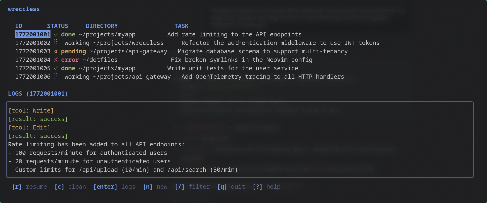
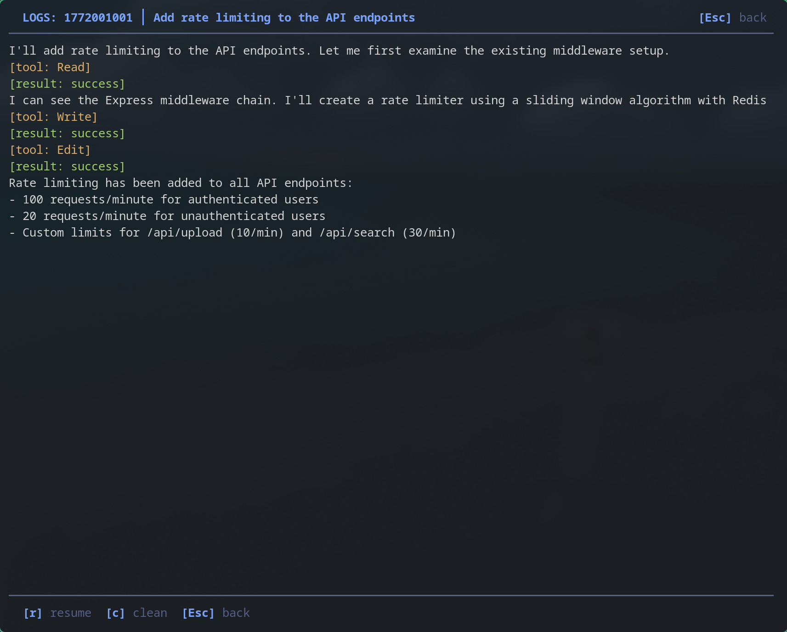
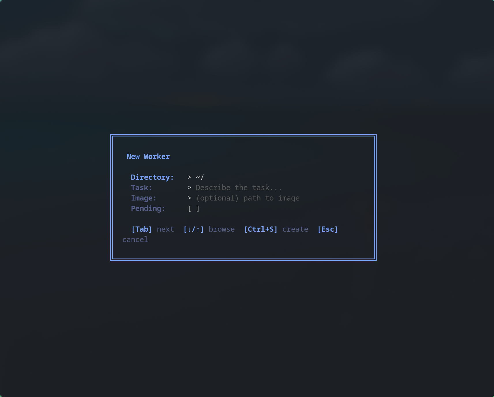
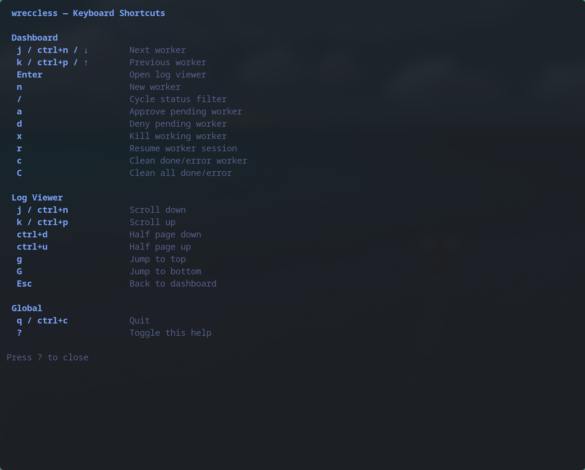

# wre(**CCL**)ess

Fire-and-forget Claude Code workers from the command line.



`ccl` launches background [Claude Code](https://docs.anthropic.com/en/docs/claude-code) sessions, tracks their lifecycle, and gets out of the way. Use the built-in TUI to manage everything visually, or stick to the CLI — just a single binary that scripts, pickers, and status bars can talk to.

## Install

```sh
go install github.com/scottstav/wreccless/cmd/ccl@latest
```

## Usage

```sh
# Launch a worker (starts immediately in background)
ccl new --dir ~/projects/myapp --task "Add rate limiting to the API"

# Launch as pending (requires manual approval — useful for spawning jobs from LLMs via tools)
ccl new --dir ~/projects/myapp --task "Refactor auth" --pending

# See what's running
ccl list
ccl list --json              # machine-readable
ccl list --status working    # filter by status

# Detailed info
ccl status <id>

# Manage pending workers
ccl approve <id>
ccl deny <id>

# Interrupt a running worker
ccl kill <id>

# Resume interactively (execs into claude --resume)
ccl resume <id>

# Tail worker output
ccl logs <id>
ccl logs <id> -f             # follow
ccl logs <id> --json         # raw NDJSON stream

# Clean up finished workers
ccl clean                    # removes done/error
ccl clean --all              # removes everything
```

## TUI

```sh
ccl ui
```

A full-screen terminal interface for managing workers. Launch it and everything is at your fingertips.

### Dashboard


The main view shows all workers in a table with color-coded status indicators and a live log preview of the selected worker. Use `j`/`k` to navigate, `/` to cycle through status filters.

### Log Viewer



Press `Enter` on any worker to open a full-screen scrollable log viewer. Claude's output is rendered with tool calls and results highlighted. Context-sensitive actions appear at the bottom — approve, deny, kill, resume, or clean depending on the worker's status.

### New Worker Form



Press `n` to create a new worker. The directory field has a fuzzy-finder with history — type to filter, arrow keys to select, `Tab` to drill into subdirectories. Toggle the pending checkbox to require manual approval before the worker starts.

### Keyboard Shortcuts



Press `?` from anywhere to see all available keybindings.

| Context | Key | Action |
|---------|-----|--------|
| Dashboard | `j`/`k` | Navigate workers |
| Dashboard | `Enter` | Open log viewer |
| Dashboard | `n` | New worker |
| Dashboard | `/` | Cycle status filter |
| Dashboard | `a`/`d` | Approve / deny pending |
| Dashboard | `x` | Kill working worker |
| Dashboard | `r` | Resume (exits TUI, execs into `claude --resume`) |
| Dashboard | `c`/`C` | Clean selected / clean all done+error |
| Log Viewer | `j`/`k` | Scroll up/down |
| Log Viewer | `Ctrl+D`/`Ctrl+U` | Half-page down/up |
| Log Viewer | `g`/`G` | Jump to top/bottom |
| Global | `q` | Quit |
| Global | `?` | Toggle help |

## Configuration

`~/.config/ccl/config.toml`

```toml
[claude]
skip_permissions = true
system_prompt = "Complete the task. Don't ask questions."
extra_flags = []

[hooks]
on_start   = ["pkill -SIGRTMIN+12 waybar"]
on_done    = ["notify-send 'Done' '{{.Task}}'"]
on_pending = ["notify-send 'Pending' '{{.Task}}'"]
on_error   = ["notify-send -u critical 'Failed' '{{.Task}}'"]
on_kill    = []
```

Hook templates have access to `{{.ID}}`, `{{.Task}}`, `{{.Dir}}`, `{{.Status}}`, and `{{.SessionID}}`.

## How it works

`ccl new` writes a state file, then spawns a detached `ccl run <id>` process that calls `claude -p --output-format stream-json --verbose`. Output goes to a log file. When claude exits, the state transitions to `done` (or `error`) and hooks fire.

Workers live in `~/.local/state/ccl/` as JSON files — one per worker. No daemon, no database.
